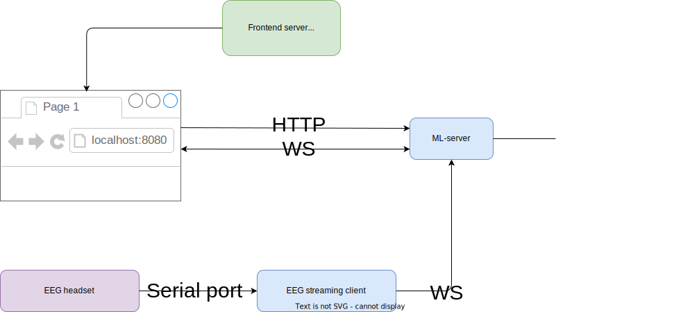

# Stack Talk

    
    

Basically, this application would compose with 3 components which are Frontend(GUI), ML service/server , and lastly EEG streaming client.

<h2>Docker</h2>

Frontend and ML service would be deployed on Docker container which are cool.Only EEG-client cannot because we want to connect EEG headset with Serial Port(USB). Serial Port could not (year 2021) work with Docker on Windows OS & Mac but it can work
    with Linux.

Please know that Docker Desktop on Windows has some issues about Networking. <a href="https://docs.docker.com/desktop/windows/networking/#i-cannot-ping-my-containers">click here</a> 

<h1 id="eeg-client">EEG streaming Client</h1>

This application needs someone(or thing) to stream EEG signal to our main core which is ML server.

Normally, Open-BCI (EEG headset brand) has 2 types of EEG connecter that are Bluetooth and Wifi (I would call it White and Orange because of its color). Most researchers use LSL (Labstreaminglayer > <a href="https://labstreaminglayer.readthedocs.io/info/getting_started.html">click me for more information</a>        ) protocol to create a streaming pipeline which is based on TCP.The main objective of LSL is for data streaming over the local network. Therefore, I decided to use WS (Websocket) for this because it's more production mode.

<h3>2021-09-28 Update!</h3>

I found problem when client did spaming 250 Hz of EEG data to server. I found FastAPI server cannot receive the data. Therefore, I changed from WS to HTTP with BATCH of data. Actually, I think we can keep using WS but please do the batch (batch means
    like pack 250 messages into 1 message and sent them together)

<h3>
    2021-10-07 Update!
</h3>

Finally, I changed back to WS but did message packing.

<h2>Bluetooth (White)</h2>

I would create a WS over Serial connection. To send the data to ML-server.

<h2>Wifi (Orange)</h2>

Currently (2021), Wifi module doesn't support.

<h2>Stack</h2>
<ol>
    <li>python lib <a href="https://pypi.org/project/pyOpenBCI/">pyopenbci</a></li>
    <li>python Requests (http client) <a href="https://docs.python-requests.org/en/latest/ ">requests</a> </li>
    <li><a href="https://pypi.org/project/websocket-client/">Websocket Client</a></li>
    <!-- <li>python Websocket client <a href="https://websockets.readthedocs.io/en/stable/">link</a> </li> -->
</ol>
<h2>Development Tips</h2>
<ul>
    <li>Package Manager: <a href="https://pipenv.pypa.io/en/latest/">pipenv</a> </li>
    <li>IDE & Editor: VSCode with Python Extension</li>
    <ul>
        <li>I recommened to create a venv using pipenv. After that, we can select the right venv inside VSCode. So, it might be helpful.</li>
    </ul>

</ul>

<h1>Frontend</h1>

I decided to use Web (actually it is HTML canvas) for GUI. I had tried to use normal HTML DOM (virtual DOM in VueJS) but I found it cannot perform the experiment because this application has a LOT of changing over the time. Forturnately, HTML Canvas
    can solve this.

However, it does not mean you needs to do like me. Basically, you can use any framework to perform GUI (ex. pygame, tkinter). To specify, if you use any GUI Python framework, you can use shared memory (ex. global queue) for process communication (WS
    is still recommened).

<h2>Stack</h2>
<ul>
    <li>Vue3 with Typescript</li>
    <li><a href="https://www.w3schools.com/html/html5_canvas.asp">HTML Canvas</a> </li>
</ul>
<h2>Development Tips</h2>
<ul>
    <li>Package Manager: Docker</li>
    <li>IDE & Editor: VSCode with Vue and Vetur Extension</li>
    <ul>
        <li>
            
Actually, Everything is wrapped in Docker container. You dont have to install NodeJS in your machine.

        </li>
        <li>
            
However, IF you want to develop. To get a good experience with VSCode and Typescript. Currently (2021) , VScode doesnt support to use an ESLint extension for typescipt in Remote Container. So, you might need to install NodeJS and dependencies
                separately.
            

        </li>
        <li>
            
2021-10-14 Update!!! Actually, ESLint can work in Dev container but please don't use alpine

        </li>
    </ul>
</ul>

<h1>ML-server</h1>

Backend API for managing everything in our Application, based on <a href="https://fastapi.tiangolo.com/">FastAPI</a>

<h2>Development Tips</h2>
<ul>
    <li>Package Manager: Docker</li>
    <li>IDE & Editor: VSCode</li>
    <ul>
        <li>Let's talk, ML-server is based inside Docker container. So, we want to make VSCode can fully understand our env and system</li>
        <li>I decided to use VSCode remote to Docker container <a href="https://code.visualstudio.com/docs/remote/containers">Developing inside a Container</a></li>
        <li>After we get inside container, I decided to install VSCode extenstion (inside container), you might have seen I already created a ml-server--vscode-server volume for this propose.</li>
    </ul>
</ul>
    